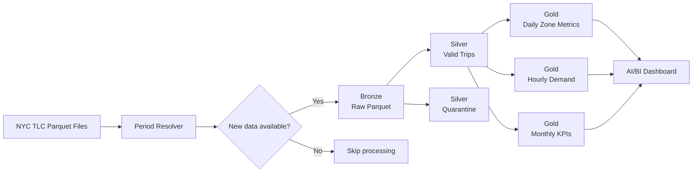
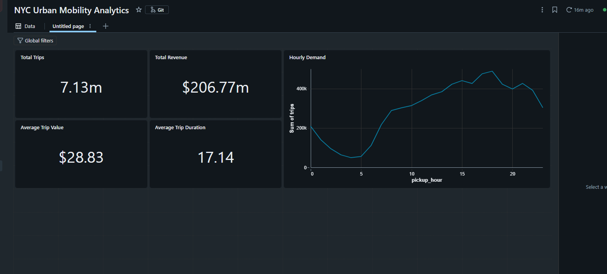

# Urban Mobility Lakehouse

An end-to-end data engineering project that processes NYC Taxi & Limousine Commission trip data using Databricks, PySpark, Delta Lake, Unity Catalog, Lakeflow Jobs, and AI/BI Dashboards.

The project implements a parameterized and idempotent Medallion Architecture pipeline, automatically discovers newly published monthly data, applies data-quality rules, quarantines invalid records, and produces analytics-ready Gold tables.

## Architecture



## Key features

- Automated monthly source discovery with a configurable lookback window
- Parameterized Yellow and Green taxi processing
- Streaming HTTP downloads with temporary-file promotion
- File-level and partition-level idempotency
- Bronze raw-data preservation in Unity Catalog volumes
- Canonical Silver schema across multiple taxi datasets
- Data-quality validation with invalid-record quarantine
- Deterministic SHA-256 trip identifiers and deduplication
- Delta Lake partition replacement using `replaceWhere`
- Execution auditing and row-count reconciliation
- Conditional Lakeflow Job execution using task values
- Serverless workflow defined as code with Databricks Declarative Automation Bundles
- Analytics-ready Gold tables and an AI/BI dashboard

## Medallion layers

### Bronze

Stores the downloaded monthly Parquet files without changing their business data.

Features:

- dynamic source URL generation
- temporary download paths
- HTTP and file-size validation
- Parquet schema validation
- atomic promotion to the final landing path
- duplicate-download prevention
- ingestion audit history

### Silver

Standardizes and validates the raw taxi records.

Data-quality rules include:

- valid pickup and drop-off timestamps
- positive trip duration
- pickup timestamp within the source month
- reasonable trip distance
- valid pickup and drop-off location IDs
- valid passenger count
- non-negative fares and totals

Records that fail validation are written to a dedicated quarantine table with their failure reasons.

### Gold

Produces three analytical Delta tables:

| Table | Grain | Purpose |
|---|---|---|
| `daily_zone_metrics` | taxi type, date, pickup location | Zone demand and revenue analysis |
| `hourly_demand_metrics` | taxi type, date, pickup hour | Hourly demand patterns |
| `monthly_kpis` | taxi type, year, month | Executive KPI reporting |

## Data-quality results

Initial Yellow Taxi test for January 2025:

- Input rows: **3,475,226**
- Valid Silver rows: **3,229,329**
- Quarantined rows: **245,897**
- Valid percentage: **92.92%**
- Exact duplicates removed: **0**
- Gold reconciliation: **3,229,329 represented trips**

The automated workflow subsequently processed an additional monthly partition. The dashboard currently represents approximately **7.13 million trips** and **$206.77 million in revenue**.

## Dashboard



The dashboard presents:

- total trip volume
- total revenue
- average trip value
- average trip duration
- hourly demand distribution

## Orchestration

The Lakeflow Job executes:

```text
resolve_period
    → new_data_available
        → bronze_ingestion
            → silver_transformation
                → gold_aggregations
```

The resolver publishes `year`, `month`, and `should_process` as task values. The downstream pipeline runs only when a published source file is absent from Bronze.

The workflow is defined in:

```text
databricks.yml
resources/urban_mobility_job.yml
```

The bundle supports:

- validation before deployment
- serverless deployment
- retries and timeouts
- maximum concurrency control
- a paused monthly schedule
- reproducible job configuration

## Technology stack

- Databricks Free Edition
- Apache Spark / PySpark
- Delta Lake
- Unity Catalog
- Lakeflow Jobs
- Databricks Declarative Automation Bundles
- Databricks CLI with OAuth
- AI/BI Dashboards
- Python
- SQL
- Git and GitHub

## Repository structure

```text
.
├── databricks.yml
├── resources/
│   └── urban_mobility_job.yml
├── notebooks/
│   ├── 00_resolve_period.ipynb
│   ├── 01_bronze_ingestion.ipynb
│   ├── 02_silver_transformation.ipynb
│   └── 03_gold_aggregations.ipynb
├── docs/
│   └── dashboard.png
├── requirements.txt
└── README.md
```

## Cost-efficiency decisions

- Databricks Free Edition serverless compute
- partition pruning on `taxi_type`, `year`, and `month`
- Bronze download skipping for existing files
- conditional workflow execution when no new data exists
- partition-scoped Delta overwrites
- small Gold aggregate tables for dashboard queries
- paused schedule during development

## Project status

Complete.